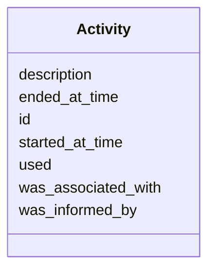

# Class: Activity
_a provence-generating activity_


URI: [prov:Activity](http://www.w3.org/ns/prov#Activity)





<!-- no inheritance hierarchy -->


## Slots

| Name | Range | Cardinality | Description  | Info |
| ---  | --- | --- | --- | --- |
| [id](id.md) | [xsd:string](xsd:string) | 0..1 | None  | . |
| [started_at_time](started_at_time.md) | [xsd:string](xsd:string) | 0..1 | None  | . |
| [ended_at_time](ended_at_time.md) | [xsd:string](xsd:string) | 0..1 | None  | . |
| [was_informed_by](was_informed_by.md) | [Activity](Activity.md) | 0..1 | None  | . |
| [was_associated_with](was_associated_with.md) | [Agent](Agent.md) | 0..1 | None  | . |
| [used](used.md) | [xsd:string](xsd:string) | 0..1 | None  | . |
| [description](description.md) | [xsd:string](xsd:string) | 0..1 | None  | . |


## Usages


| used by | used in | type | used |
| ---  | --- | --- | --- |
| [Change](Change.md) | [was_generated_by](was_generated_by.md) | range | activity |
| [SimpleChange](SimpleChange.md) | [was_generated_by](was_generated_by.md) | range | activity |
| [ComplexChange](ComplexChange.md) | [was_generated_by](was_generated_by.md) | range | activity |
| [MultiNodeObsoletion](MultiNodeObsoletion.md) | [was_generated_by](was_generated_by.md) | range | activity |
| [Transaction](Transaction.md) | [was_generated_by](was_generated_by.md) | range | activity |
| [EdgeChange](EdgeChange.md) | [was_generated_by](was_generated_by.md) | range | activity |
| [EdgeCreation](EdgeCreation.md) | [was_generated_by](was_generated_by.md) | range | activity |
| [PlaceUnder](PlaceUnder.md) | [was_generated_by](was_generated_by.md) | range | activity |
| [EdgeDeletion](EdgeDeletion.md) | [was_generated_by](was_generated_by.md) | range | activity |
| [RemoveUnder](RemoveUnder.md) | [was_generated_by](was_generated_by.md) | range | activity |
| [EdgeObsoletion](EdgeObsoletion.md) | [was_generated_by](was_generated_by.md) | range | activity |
| [EdgeRewiring](EdgeRewiring.md) | [was_generated_by](was_generated_by.md) | range | activity |
| [MappingCreation](MappingCreation.md) | [was_generated_by](was_generated_by.md) | range | activity |
| [NodeMove](NodeMove.md) | [was_generated_by](was_generated_by.md) | range | activity |
| [NodeDeepening](NodeDeepening.md) | [was_generated_by](was_generated_by.md) | range | activity |
| [NodeShallowing](NodeShallowing.md) | [was_generated_by](was_generated_by.md) | range | activity |
| [PredicateChange](PredicateChange.md) | [was_generated_by](was_generated_by.md) | range | activity |
| [EdgeLogicalInterpretationChange](EdgeLogicalInterpretationChange.md) | [was_generated_by](was_generated_by.md) | range | activity |
| [LogicalAxiomChange](LogicalAxiomChange.md) | [was_generated_by](was_generated_by.md) | range | activity |
| [NodeChange](NodeChange.md) | [was_generated_by](was_generated_by.md) | range | activity |
| [NodeRename](NodeRename.md) | [was_generated_by](was_generated_by.md) | range | activity |
| [SetLanguageForName](SetLanguageForName.md) | [was_generated_by](was_generated_by.md) | range | activity |
| [NodeAnnotationChange](NodeAnnotationChange.md) | [was_generated_by](was_generated_by.md) | range | activity |
| [NodeAnnotationReplacement](NodeAnnotationReplacement.md) | [was_generated_by](was_generated_by.md) | range | activity |
| [NodeSynonymChange](NodeSynonymChange.md) | [was_generated_by](was_generated_by.md) | range | activity |
| [NewSynonym](NewSynonym.md) | [was_generated_by](was_generated_by.md) | range | activity |
| [NameBecomesSynonym](NameBecomesSynonym.md) | [was_generated_by](was_generated_by.md) | range | activity |
| [RemoveSynonym](RemoveSynonym.md) | [was_generated_by](was_generated_by.md) | range | activity |
| [SynonymReplacement](SynonymReplacement.md) | [was_generated_by](was_generated_by.md) | range | activity |
| [SynonymPredicateChange](SynonymPredicateChange.md) | [was_generated_by](was_generated_by.md) | range | activity |
| [NodeTextDefinitionChange](NodeTextDefinitionChange.md) | [was_generated_by](was_generated_by.md) | range | activity |
| [NewTextDefinition](NewTextDefinition.md) | [was_generated_by](was_generated_by.md) | range | activity |
| [RemoveTextDefinition](RemoveTextDefinition.md) | [was_generated_by](was_generated_by.md) | range | activity |
| [TextDefinitionReplacement](TextDefinitionReplacement.md) | [was_generated_by](was_generated_by.md) | range | activity |
| [AddNodeToSubset](AddNodeToSubset.md) | [was_generated_by](was_generated_by.md) | range | activity |
| [RemovedNodeFromSubset](RemovedNodeFromSubset.md) | [was_generated_by](was_generated_by.md) | range | activity |
| [NodeObsoletion](NodeObsoletion.md) | [was_generated_by](was_generated_by.md) | range | activity |
| [NodeUnobsoletion](NodeUnobsoletion.md) | [was_generated_by](was_generated_by.md) | range | activity |
| [NodeCreation](NodeCreation.md) | [was_generated_by](was_generated_by.md) | range | activity |
| [ClassCreation](ClassCreation.md) | [was_generated_by](was_generated_by.md) | range | activity |
| [NodeDeletion](NodeDeletion.md) | [was_generated_by](was_generated_by.md) | range | activity |
| [NodeDirectMerge](NodeDirectMerge.md) | [was_generated_by](was_generated_by.md) | range | activity |
| [NodeObsoletionWithDirectReplacement](NodeObsoletionWithDirectReplacement.md) | [was_generated_by](was_generated_by.md) | range | activity |
| [NodeObsoletionWithNoDirectReplacement](NodeObsoletionWithNoDirectReplacement.md) | [was_generated_by](was_generated_by.md) | range | activity |
| [Session](Session.md) | [activity_set](activity_set.md) | range | activity |
| [Activity](Activity.md) | [was_informed_by](was_informed_by.md) | range | activity |
| [Activity](Activity.md) | [used](used.md) | domain | activity |
| [Agent](Agent.md) | [was_informed_by](was_informed_by.md) | range | activity |


## Identifier and Mapping Information


### Schema Source


* from schema: https://w3id.org/kgcl/prov


## Mappings

| Mapping Type | Mapped Value |
| ---  | ---  |
| self | ['prov:Activity'] |
| native | ['prov:Activity'] |
| undefined | ['prov:Activity'] |


## LinkML Specification

<!-- TODO: investigate https://stackoverflow.com/questions/37606292/how-to-create-tabbed-code-blocks-in-mkdocs-or-sphinx -->

### Direct

<details>
```yaml
name: activity
description: a provence-generating activity
from_schema: https://w3id.org/kgcl/prov
mappings:
- prov:Activity
slots:
- id
- started at time
- ended at time
- was informed by
- was associated with
- used
- description

```
</details>

### Induced

<details>
```yaml
name: activity
description: a provence-generating activity
from_schema: https://w3id.org/kgcl/prov
mappings:
- prov:Activity
attributes:
  id:
    name: id
    from_schema: https://w3id.org/kgcl/basics
    identifier: true
    alias: id
    owner: activity
    range: string
  started at time:
    name: started at time
    from_schema: https://w3id.org/kgcl/prov
    slot_uri: prov:startedAtTime
    alias: started_at_time
    owner: activity
    range: string
  ended at time:
    name: ended at time
    from_schema: https://w3id.org/kgcl/prov
    slot_uri: prov:endedAtTime
    alias: ended_at_time
    owner: activity
    range: string
  was informed by:
    name: was informed by
    from_schema: https://w3id.org/kgcl/prov
    slot_uri: prov:wasInformedBy
    alias: was_informed_by
    owner: activity
    range: activity
  was associated with:
    name: was associated with
    from_schema: https://w3id.org/kgcl/prov
    slot_uri: prov:wasAssociatedWith
    alias: was_associated_with
    owner: activity
    range: agent
    inlined: false
  used:
    name: used
    from_schema: https://w3id.org/kgcl/prov
    domain: activity
    slot_uri: prov:used
    alias: used
    owner: activity
    range: string
  description:
    name: description
    from_schema: https://w3id.org/kgcl/basics
    slot_uri: dcterms:description
    alias: description
    owner: activity
    range: string

```
</details>