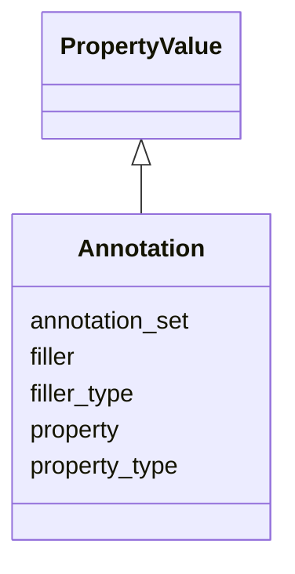

# Class: Annotation
_owl annotations. Not to be confused with annotations sensu GO_


URI: [om:Annotation](om:Annotation)





## Inheritance
* [OntologyElement](OntologyElement.md)
    * [PropertyValue](PropertyValue.md)
        * **Annotation**


## Slots

| Name | Range | Cardinality | Description  | Info |
| ---  | --- | --- | --- | --- |
| [property](property.md) | [Node](Node.md) | 0..1 | None  | . |
| [filler](filler.md) | [xsd:string](xsd:string) | 0..1 | None  | . |
| [annotation_set](annotation_set.md) | [Annotation](Annotation.md) | 0..1 | None  | . |
| [property_type](property_type.md) | [xsd:string](xsd:string) | 0..1 | None  | . |
| [filler_type](filler_type.md) | [xsd:string](xsd:string) | 0..1 | None  | . |


## Usages


| used by | used in | type | used |
| ---  | --- | --- | --- |
| [EdgeCreation](EdgeCreation.md) | [annotation_set](annotation_set.md) | range | annotation |
| [PlaceUnder](PlaceUnder.md) | [annotation_set](annotation_set.md) | range | annotation |
| [EdgeDeletion](EdgeDeletion.md) | [annotation_set](annotation_set.md) | range | annotation |
| [RemoveUnder](RemoveUnder.md) | [annotation_set](annotation_set.md) | range | annotation |
| [EdgeObsoletion](EdgeObsoletion.md) | [annotation_set](annotation_set.md) | range | annotation |
| [MappingCreation](MappingCreation.md) | [annotation_set](annotation_set.md) | range | annotation |
| [NodeCreation](NodeCreation.md) | [annotation_set](annotation_set.md) | range | annotation |
| [ClassCreation](ClassCreation.md) | [annotation_set](annotation_set.md) | range | annotation |
| [Annotation](Annotation.md) | [annotation_set](annotation_set.md) | range | annotation |
| [Node](Node.md) | [annotation_set](annotation_set.md) | range | annotation |
| [ClassNode](ClassNode.md) | [annotation_set](annotation_set.md) | range | annotation |
| [InstanceNode](InstanceNode.md) | [annotation_set](annotation_set.md) | range | annotation |
| [Edge](Edge.md) | [annotation_set](annotation_set.md) | range | annotation |


## Identifier and Mapping Information


### Schema Source


* from schema: https://w3id.org/kgcl/ontology


## Mappings

| Mapping Type | Mapped Value |
| ---  | ---  |
| self | ['om:Annotation'] |
| native | ['om:Annotation'] |
| undefined | ['owl:Annotation'] |


## LinkML Specification

<!-- TODO: investigate https://stackoverflow.com/questions/37606292/how-to-create-tabbed-code-blocks-in-mkdocs-or-sphinx -->

### Direct

<details>
```yaml
name: annotation
description: owl annotations. Not to be confused with annotations sensu GO
from_schema: https://w3id.org/kgcl/ontology
mappings:
- owl:Annotation
is_a: property value
slots:
- property
- filler
- annotation set
- property type
- filler type

```
</details>

### Induced

<details>
```yaml
name: annotation
description: owl annotations. Not to be confused with annotations sensu GO
from_schema: https://w3id.org/kgcl/ontology
mappings:
- owl:Annotation
is_a: property value
attributes:
  property:
    name: property
    from_schema: https://w3id.org/kgcl/ontology
    alias: property
    owner: annotation
    range: node
  filler:
    name: filler
    from_schema: https://w3id.org/kgcl/ontology
    alias: filler
    owner: annotation
    range: string
  annotation set:
    name: annotation set
    from_schema: https://w3id.org/kgcl/ontology
    alias: annotation_set
    owner: annotation
    range: annotation
  property type:
    name: property type
    from_schema: https://w3id.org/kgcl/ontology
    alias: property_type
    owner: annotation
    range: string
  filler type:
    name: filler type
    from_schema: https://w3id.org/kgcl/ontology
    alias: filler_type
    owner: annotation
    range: string

```
</details>