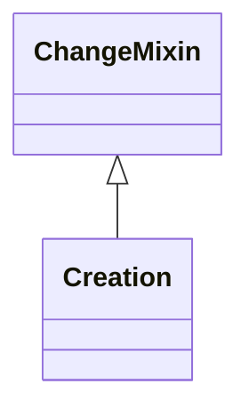

# Class: Creation
_Creation of an element._


* __NOTE__: this is a mixin class intended to be used in combination with other classes, and not used directly


URI: [kgcl:Creation](http://w3id.org/kgcl/Creation)





## Inheritance
* [ChangeMixin](ChangeMixin.md)
    * **Creation**


## Slots

| Name | Range | Cardinality | Description  | Info |
| ---  | --- | --- | --- | --- |


## Usages


## Identifier and Mapping Information


### Schema Source


* from schema: https://w3id.org/kgcl


## Mappings

| Mapping Type | Mapped Value |
| ---  | ---  |
| self | ['kgcl:Creation'] |
| native | ['kgcl:Creation'] |


## LinkML Specification

<!-- TODO: investigate https://stackoverflow.com/questions/37606292/how-to-create-tabbed-code-blocks-in-mkdocs-or-sphinx -->

### Direct

<details>
```yaml
name: creation
description: Creation of an element.
from_schema: https://w3id.org/kgcl
is_a: change mixin
mixin: true
slot_usage:
  has undo:
    name: has undo
    range: deletion

```
</details>

### Induced

<details>
```yaml
name: creation
description: Creation of an element.
from_schema: https://w3id.org/kgcl
is_a: change mixin
mixin: true
slot_usage:
  has undo:
    name: has undo
    range: deletion

```
</details>