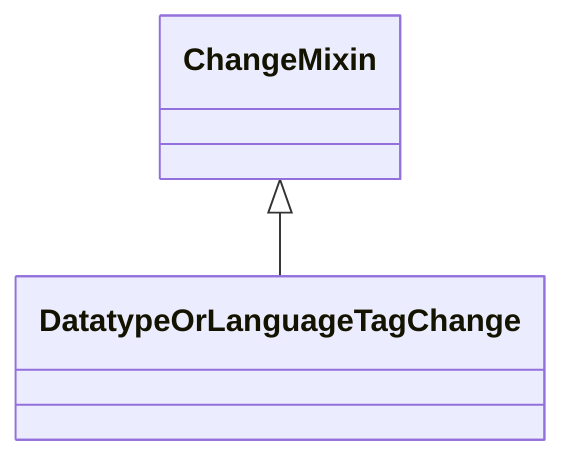

# Class: DatatypeOrLanguageTagChange
_A change in a value assertion where the value remain unchanged but either the datatype or language changes_


* __NOTE__: this is a mixin class intended to be used in combination with other classes, and not used directly


URI: [kgcl:DatatypeOrLanguageTagChange](http://w3id.org/kgcl/DatatypeOrLanguageTagChange)





## Inheritance
* [ChangeMixin](ChangeMixin.md)
    * **DatatypeOrLanguageTagChange**
        * [LanguageTagChange](LanguageTagChange.md)
        * [DatatypeChange](DatatypeChange.md)


## Slots

| Name | Range | Cardinality | Description  | Info |
| ---  | --- | --- | --- | --- |


## Usages


## Identifier and Mapping Information


### Schema Source


* from schema: https://w3id.org/kgcl


## Mappings

| Mapping Type | Mapped Value |
| ---  | ---  |
| self | ['kgcl:DatatypeOrLanguageTagChange'] |
| native | ['kgcl:DatatypeOrLanguageTagChange'] |


## LinkML Specification

<!-- TODO: investigate https://stackoverflow.com/questions/37606292/how-to-create-tabbed-code-blocks-in-mkdocs-or-sphinx -->

### Direct

<details>
```yaml
name: datatype or language tag change
description: A change in a value assertion where the value remain unchanged but either
  the datatype or language changes
from_schema: https://w3id.org/kgcl
is_a: change mixin
mixin: true

```
</details>

### Induced

<details>
```yaml
name: datatype or language tag change
description: A change in a value assertion where the value remain unchanged but either
  the datatype or language changes
from_schema: https://w3id.org/kgcl
is_a: change mixin
mixin: true

```
</details>