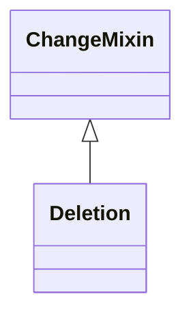

# Class: Deletion
_Removal of an element._


* __NOTE__: this is a mixin class intended to be used in combination with other classes, and not used directly


URI: [kgcl:Deletion](http://w3id.org/kgcl/Deletion)





## Inheritance
* [ChangeMixin](ChangeMixin.md)
    * **Deletion**


## Slots

| Name | Range | Cardinality | Description  | Info |
| ---  | --- | --- | --- | --- |


## Usages


| used by | used in | type | used |
| ---  | --- | --- | --- |
| [EdgeCreation](EdgeCreation.md) | [has_undo](has_undo.md) | range | deletion |
| [PlaceUnder](PlaceUnder.md) | [has_undo](has_undo.md) | range | deletion |
| [MappingCreation](MappingCreation.md) | [has_undo](has_undo.md) | range | deletion |
| [NodeCreation](NodeCreation.md) | [has_undo](has_undo.md) | range | deletion |
| [ClassCreation](ClassCreation.md) | [has_undo](has_undo.md) | range | deletion |


## Identifier and Mapping Information


### Schema Source


* from schema: https://w3id.org/kgcl


## Mappings

| Mapping Type | Mapped Value |
| ---  | ---  |
| self | ['kgcl:Deletion'] |
| native | ['kgcl:Deletion'] |


## LinkML Specification

<!-- TODO: investigate https://stackoverflow.com/questions/37606292/how-to-create-tabbed-code-blocks-in-mkdocs-or-sphinx -->

### Direct

<details>
```yaml
name: deletion
description: Removal of an element.
comments:
- In general, for OBO ontologies, node elements should never be deleted, always obsolete.
  However, edge deletion is more common.
from_schema: https://w3id.org/kgcl
is_a: change mixin
mixin: true

```
</details>

### Induced

<details>
```yaml
name: deletion
description: Removal of an element.
comments:
- In general, for OBO ontologies, node elements should never be deleted, always obsolete.
  However, edge deletion is more common.
from_schema: https://w3id.org/kgcl
is_a: change mixin
mixin: true

```
</details>