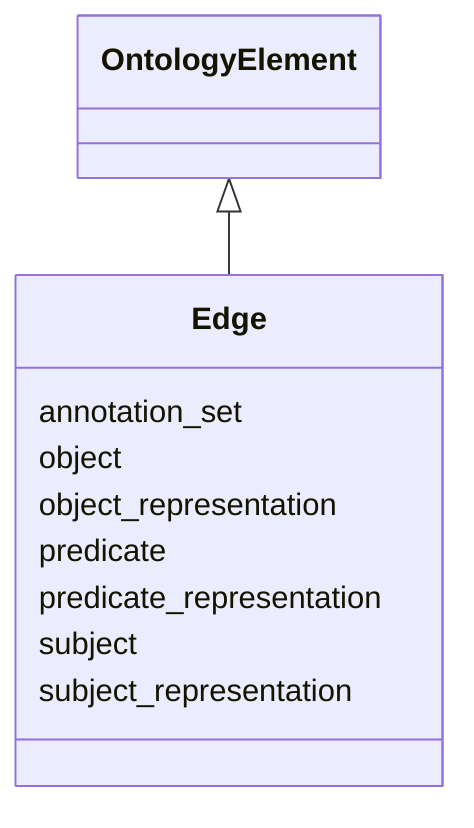

# Class: Edge
_A relationship between two nodes.
Currently the only kinds of edges supported in KGCL:

  * A subClassOf B <==> Edge(subject=A, predicate=owl:subClassOf, object=B)
  * A subClassOf P some B <==> Edge(subject=A, predicate=P, object=B)
  * P subPropertyOf Q <==> Edge(subject=P, predicate=owl:subPropertyOf, object=Q)

These represent the most common kind of pairwise relationship between classes, and classes are the dominant node type in ontologies.
  
In future a wider variety of OWL axiom types will be supportedn through the use of an additional edge property/slot to indicate the interpretation of the axiom, following owlstar (https://github.com/cmungall/owlstar).
For example:
 * `A subClassOf R only B <==> Edge(subject=A, predicate=P, object=B, interpretation=AllOnly)`
 * `A Annotation(P,B) <==> Edge(subject=A, predicate=P, object=B, interpretation=annotationAssertion)`

Note that not all axioms are intended to map to edges. Axioms/triples where the object is a literal would be represented as node properties. Complex OWL axioms involving nesting would have their own dedicated construct, or may be represented generically. These are out of scope for the current version of KGCL_


URI: [om:Edge](om:Edge)





## Inheritance
* [OntologyElement](OntologyElement.md)
    * **Edge**


## Slots

| Name | Range | Cardinality | Description  | Info |
| ---  | --- | --- | --- | --- |
| [subject](subject.md) | [Node](Node.md) | 0..1 | None  | . |
| [predicate](predicate.md) | [Node](Node.md) | 0..1 | None  | . |
| [object](object.md) | [Node](Node.md) | 0..1 | None  | . |
| [subject_representation](subject_representation.md) | [xsd:string](xsd:string) | 0..1 | None  | . |
| [predicate_representation](predicate_representation.md) | [xsd:string](xsd:string) | 0..1 | None  | . |
| [object_representation](object_representation.md) | [xsd:string](xsd:string) | 0..1 | None  | . |
| [annotation_set](annotation_set.md) | [Annotation](Annotation.md) | 0..1 | None  | . |


## Usages


| used by | used in | type | used |
| ---  | --- | --- | --- |
| [EdgeChange](EdgeChange.md) | [about_edge](about_edge.md) | range | edge |
| [EdgeCreation](EdgeCreation.md) | [about_edge](about_edge.md) | range | edge |
| [PlaceUnder](PlaceUnder.md) | [about_edge](about_edge.md) | range | edge |
| [EdgeDeletion](EdgeDeletion.md) | [about_edge](about_edge.md) | range | edge |
| [RemoveUnder](RemoveUnder.md) | [about_edge](about_edge.md) | range | edge |
| [EdgeObsoletion](EdgeObsoletion.md) | [about_edge](about_edge.md) | range | edge |
| [EdgeRewiring](EdgeRewiring.md) | [about_edge](about_edge.md) | range | edge |
| [MappingCreation](MappingCreation.md) | [about_edge](about_edge.md) | range | edge |
| [NodeMove](NodeMove.md) | [about_edge](about_edge.md) | range | edge |
| [NodeDeepening](NodeDeepening.md) | [about_edge](about_edge.md) | range | edge |
| [NodeShallowing](NodeShallowing.md) | [about_edge](about_edge.md) | range | edge |
| [PredicateChange](PredicateChange.md) | [about_edge](about_edge.md) | range | edge |
| [EdgeLogicalInterpretationChange](EdgeLogicalInterpretationChange.md) | [about_edge](about_edge.md) | range | edge |


## Identifier and Mapping Information


### Schema Source


* from schema: https://w3id.org/kgcl/ontology


## Mappings

| Mapping Type | Mapped Value |
| ---  | ---  |
| self | ['om:Edge'] |
| native | ['om:Edge'] |
| undefined | ['owl:Axiom', 'rdf:Statement'] |


## LinkML Specification

<!-- TODO: investigate https://stackoverflow.com/questions/37606292/how-to-create-tabbed-code-blocks-in-mkdocs-or-sphinx -->

### Direct

<details>
```yaml
name: edge
description: "A relationship between two nodes.\nCurrently the only kinds of edges\
  \ supported in KGCL:\n\n  * A subClassOf B <==> Edge(subject=A, predicate=owl:subClassOf,\
  \ object=B)\n  * A subClassOf P some B <==> Edge(subject=A, predicate=P, object=B)\n\
  \  * P subPropertyOf Q <==> Edge(subject=P, predicate=owl:subPropertyOf, object=Q)\n\
  \nThese represent the most common kind of pairwise relationship between classes,\
  \ and classes are the dominant node type in ontologies.\n  \nIn future a wider variety\
  \ of OWL axiom types will be supportedn through the use of an additional edge property/slot\
  \ to indicate the interpretation of the axiom, following owlstar (https://github.com/cmungall/owlstar).\n\
  For example:\n * `A subClassOf R only B <==> Edge(subject=A, predicate=P, object=B,\
  \ interpretation=AllOnly)`\n * `A Annotation(P,B) <==> Edge(subject=A, predicate=P,\
  \ object=B, interpretation=annotationAssertion)`\n\nNote that not all axioms are\
  \ intended to map to edges. Axioms/triples where the object is a literal would be\
  \ represented as node properties. Complex OWL axioms involving nesting would have\
  \ their own dedicated construct, or may be represented generically. These are out\
  \ of scope for the current version of KGCL"
from_schema: https://w3id.org/kgcl/ontology
aliases:
- triple
- axiom
- relationship
mappings:
- owl:Axiom
- rdf:Statement
is_a: ontology element
slots:
- subject
- predicate
- object
- subject representation
- predicate representation
- object representation
- annotation set

```
</details>

### Induced

<details>
```yaml
name: edge
description: "A relationship between two nodes.\nCurrently the only kinds of edges\
  \ supported in KGCL:\n\n  * A subClassOf B <==> Edge(subject=A, predicate=owl:subClassOf,\
  \ object=B)\n  * A subClassOf P some B <==> Edge(subject=A, predicate=P, object=B)\n\
  \  * P subPropertyOf Q <==> Edge(subject=P, predicate=owl:subPropertyOf, object=Q)\n\
  \nThese represent the most common kind of pairwise relationship between classes,\
  \ and classes are the dominant node type in ontologies.\n  \nIn future a wider variety\
  \ of OWL axiom types will be supportedn through the use of an additional edge property/slot\
  \ to indicate the interpretation of the axiom, following owlstar (https://github.com/cmungall/owlstar).\n\
  For example:\n * `A subClassOf R only B <==> Edge(subject=A, predicate=P, object=B,\
  \ interpretation=AllOnly)`\n * `A Annotation(P,B) <==> Edge(subject=A, predicate=P,\
  \ object=B, interpretation=annotationAssertion)`\n\nNote that not all axioms are\
  \ intended to map to edges. Axioms/triples where the object is a literal would be\
  \ represented as node properties. Complex OWL axioms involving nesting would have\
  \ their own dedicated construct, or may be represented generically. These are out\
  \ of scope for the current version of KGCL"
from_schema: https://w3id.org/kgcl/ontology
aliases:
- triple
- axiom
- relationship
mappings:
- owl:Axiom
- rdf:Statement
is_a: ontology element
attributes:
  subject:
    name: subject
    from_schema: https://w3id.org/kgcl/ontology
    alias: subject
    owner: edge
    range: node
  predicate:
    name: predicate
    from_schema: https://w3id.org/kgcl/ontology
    alias: predicate
    owner: edge
    range: node
  object:
    name: object
    from_schema: https://w3id.org/kgcl/ontology
    alias: object
    owner: edge
    range: node
  subject representation:
    name: subject representation
    from_schema: https://w3id.org/kgcl/ontology
    alias: subject_representation
    owner: edge
    range: string
  predicate representation:
    name: predicate representation
    from_schema: https://w3id.org/kgcl/ontology
    alias: predicate_representation
    owner: edge
    range: string
  object representation:
    name: object representation
    from_schema: https://w3id.org/kgcl/ontology
    alias: object_representation
    owner: edge
    range: string
  annotation set:
    name: annotation set
    from_schema: https://w3id.org/kgcl/ontology
    alias: annotation_set
    owner: edge
    range: annotation

```
</details>