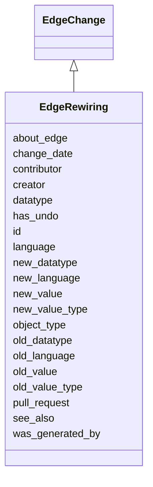

# Class: EdgeRewiring
_An edge change where one node is replaced with another, as in the case of obsoletion with replacement_


URI: [kgcl:EdgeRewiring](http://w3id.org/kgcl/EdgeRewiring)





## Inheritance
* [Change](Change.md)
    * [SimpleChange](SimpleChange.md)
        * [EdgeChange](EdgeChange.md)
            * **EdgeRewiring**


## Slots

| Name | Range | Cardinality | Description  | Info |
| ---  | --- | --- | --- | --- |
| [about_edge](about_edge.md) | [Edge](Edge.md) | 0..1 | None  | . |
| [object_type](object_type.md) | [xsd:string](xsd:string) | 0..1 | The type (IRI or Literal) of an object  | . |
| [language](language.md) | [language_tag](language_tag.md) | 0..1 | The language tag of a literal  | . |
| [datatype](datatype.md) | [xsd:string](xsd:string) | 0..1 | The datatype of a literal  | . |
| [old_value](old_value.md) | [xsd:string](xsd:string) | 0..1 | The value of a property held in the old instance of the ontology  | . |
| [new_value](new_value.md) | [xsd:string](xsd:string) | 0..1 | The value of a property held in the new instance of the ontology  | . |
| [old_value_type](old_value_type.md) | [xsd:string](xsd:string) | 0..1 | The type (IRI or Literal) of an old value  | . |
| [new_value_type](new_value_type.md) | [xsd:string](xsd:string) | 0..1 | The type (IRI or Literal) of a new value  | . |
| [new_language](new_language.md) | [xsd:string](xsd:string) | 0..1 | The new language tag of a literal  | . |
| [old_language](old_language.md) | [xsd:string](xsd:string) | 0..1 | The old language tag of a literal  | . |
| [new_datatype](new_datatype.md) | [xsd:string](xsd:string) | 0..1 | The new datatype of a literal  | . |
| [old_datatype](old_datatype.md) | [xsd:string](xsd:string) | 0..1 | The old datatype of a literal  | . |
| [id](id.md) | [xsd:string](xsd:string) | 0..1 | None  | . |
| [was_generated_by](was_generated_by.md) | [Activity](Activity.md) | 0..1 | None  | . |
| [see_also](see_also.md) | [xsd:string](xsd:string) | 0..1 | None  | . |
| [pull_request](pull_request.md) | [xsd:string](xsd:string) | 0..1 | None  | . |
| [creator](creator.md) | [xsd:string](xsd:string) | 0..1 | None  | . |
| [change_date](change_date.md) | [xsd:string](xsd:string) | 0..1 | None  | . |
| [contributor](contributor.md) | [xsd:string](xsd:string) | 0..1 | None  | . |
| [has_undo](has_undo.md) | [Change](Change.md) | 0..1 | A change that reverses this change  | . |


## Usages


## Identifier and Mapping Information


### Schema Source


* from schema: https://w3id.org/kgcl


## Mappings

| Mapping Type | Mapped Value |
| ---  | ---  |
| self | ['kgcl:EdgeRewiring'] |
| native | ['kgcl:EdgeRewiring'] |


## LinkML Specification

<!-- TODO: investigate https://stackoverflow.com/questions/37606292/how-to-create-tabbed-code-blocks-in-mkdocs-or-sphinx -->

### Direct

<details>
```yaml
name: edge rewiring
description: An edge change where one node is replaced with another, as in the case
  of obsoletion with replacement
examples:
- value: changing G1 annotated-to T1 to G1 annotated-to T2, after obsoletion of T1
    and replacement with T2
from_schema: https://w3id.org/kgcl
is_a: edge change

```
</details>

### Induced

<details>
```yaml
name: edge rewiring
description: An edge change where one node is replaced with another, as in the case
  of obsoletion with replacement
examples:
- value: changing G1 annotated-to T1 to G1 annotated-to T2, after obsoletion of T1
    and replacement with T2
from_schema: https://w3id.org/kgcl
is_a: edge change
attributes:
  about edge:
    name: about edge
    from_schema: https://w3id.org/kgcl
    is_a: about
    multivalued: false
    alias: about_edge
    owner: edge rewiring
    range: edge
  object type:
    name: object type
    description: The type (IRI or Literal) of an object
    from_schema: https://w3id.org/kgcl
    alias: object_type
    owner: edge rewiring
    range: string
  language:
    name: language
    description: The language tag of a literal
    from_schema: https://w3id.org/kgcl
    alias: language
    owner: edge rewiring
    range: language tag
  datatype:
    name: datatype
    description: The datatype of a literal
    from_schema: https://w3id.org/kgcl
    alias: datatype
    owner: edge rewiring
    range: string
  old value:
    name: old value
    description: The value of a property held in the old instance of the ontology
    from_schema: https://w3id.org/kgcl
    alias: old_value
    owner: edge rewiring
    range: string
  new value:
    name: new value
    description: The value of a property held in the new instance of the ontology
    from_schema: https://w3id.org/kgcl
    alias: new_value
    owner: edge rewiring
    range: string
  old value type:
    name: old value type
    description: The type (IRI or Literal) of an old value
    from_schema: https://w3id.org/kgcl
    alias: old_value_type
    owner: edge rewiring
    range: string
  new value type:
    name: new value type
    description: The type (IRI or Literal) of a new value
    from_schema: https://w3id.org/kgcl
    alias: new_value_type
    owner: edge rewiring
    range: string
  new language:
    name: new language
    description: The new language tag of a literal
    from_schema: https://w3id.org/kgcl
    alias: new_language
    owner: edge rewiring
    range: string
  old language:
    name: old language
    description: The old language tag of a literal
    from_schema: https://w3id.org/kgcl
    alias: old_language
    owner: edge rewiring
    range: string
  new datatype:
    name: new datatype
    description: The new datatype of a literal
    from_schema: https://w3id.org/kgcl
    alias: new_datatype
    owner: edge rewiring
    range: string
  old datatype:
    name: old datatype
    description: The old datatype of a literal
    from_schema: https://w3id.org/kgcl
    alias: old_datatype
    owner: edge rewiring
    range: string
  id:
    name: id
    from_schema: https://w3id.org/kgcl/basics
    identifier: true
    alias: id
    owner: edge rewiring
    range: string
  was generated by:
    name: was generated by
    from_schema: https://w3id.org/kgcl/prov
    slot_uri: prov:wasGeneratedBy
    alias: was_generated_by
    owner: edge rewiring
    range: activity
  see also:
    name: see also
    from_schema: https://w3id.org/kgcl
    slot_uri: rdfs:seeAlso
    alias: see_also
    owner: edge rewiring
    range: string
  pull request:
    name: pull request
    from_schema: https://w3id.org/kgcl
    alias: pull_request
    owner: edge rewiring
    range: string
  creator:
    name: creator
    from_schema: https://w3id.org/kgcl
    slot_uri: dcterms:creator
    alias: creator
    owner: edge rewiring
    range: string
  change date:
    name: change date
    from_schema: https://w3id.org/kgcl
    slot_uri: dcterms:date
    alias: change_date
    owner: edge rewiring
    range: string
  contributor:
    name: contributor
    from_schema: https://w3id.org/kgcl
    slot_uri: dcterms:creator
    alias: contributor
    owner: edge rewiring
    range: string
  has undo:
    name: has undo
    description: A change that reverses this change
    from_schema: https://w3id.org/kgcl
    domain: change
    multivalued: false
    alias: has_undo
    owner: edge rewiring
    range: change

```
</details>