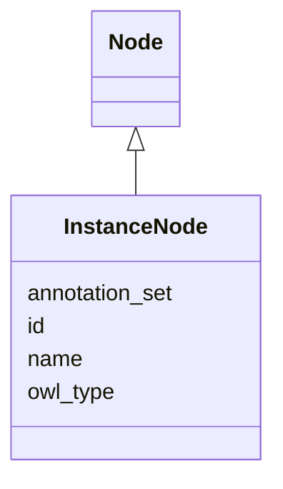

# Class: InstanceNode
_A node that is an individual_


URI: [owl:NamedIndividual](owl:NamedIndividual)





## Inheritance
* [OntologyElement](OntologyElement.md)
    * [Node](Node.md)
        * **InstanceNode**


## Slots

| Name | Range | Cardinality | Description  | Info |
| ---  | --- | --- | --- | --- |
| [id](id.md) | [xsd:string](xsd:string) | 0..1 | None  | . |
| [name](name.md) | [xsd:string](xsd:string) | 0..1 | None  | . |
| [annotation_set](annotation_set.md) | [Annotation](Annotation.md) | 0..1 | None  | . |
| [owl_type](owl_type.md) | [OwlTypeEnum](OwlTypeEnum.md) | 0..1 | None  | . |


## Usages


## Identifier and Mapping Information


### Schema Source


* from schema: https://w3id.org/kgcl/ontology


## Mappings

| Mapping Type | Mapped Value |
| ---  | ---  |
| self | ['owl:NamedIndividual'] |
| native | ['om:InstanceNode'] |


## LinkML Specification

<!-- TODO: investigate https://stackoverflow.com/questions/37606292/how-to-create-tabbed-code-blocks-in-mkdocs-or-sphinx -->

### Direct

<details>
```yaml
name: instance node
description: A node that is an individual
from_schema: https://w3id.org/kgcl/ontology
aliases:
- named individual
is_a: node
class_uri: owl:NamedIndividual

```
</details>

### Induced

<details>
```yaml
name: instance node
description: A node that is an individual
from_schema: https://w3id.org/kgcl/ontology
aliases:
- named individual
is_a: node
attributes:
  id:
    name: id
    from_schema: https://w3id.org/kgcl/basics
    identifier: true
    alias: id
    owner: instance node
    range: string
  name:
    name: name
    from_schema: https://w3id.org/kgcl/ontology
    alias: name
    owner: instance node
    range: string
  annotation set:
    name: annotation set
    from_schema: https://w3id.org/kgcl/ontology
    alias: annotation_set
    owner: instance node
    range: annotation
  owl type:
    name: owl type
    from_schema: https://w3id.org/kgcl/ontology
    alias: owl_type
    owner: instance node
    range: owl_type_enum
class_uri: owl:NamedIndividual

```
</details>