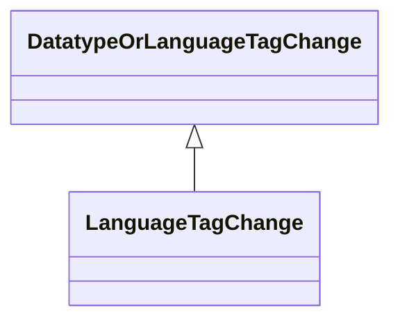

# Class: LanguageTagChange


URI: [kgcl:LanguageTagChange](http://w3id.org/kgcl/LanguageTagChange)





## Inheritance
* [ChangeMixin](ChangeMixin.md)
    * [DatatypeOrLanguageTagChange](DatatypeOrLanguageTagChange.md)
        * **LanguageTagChange**


## Slots

| Name | Range | Cardinality | Description  | Info |
| ---  | --- | --- | --- | --- |


## Usages


## Identifier and Mapping Information


### Schema Source


* from schema: https://w3id.org/kgcl


## Mappings

| Mapping Type | Mapped Value |
| ---  | ---  |
| self | ['kgcl:LanguageTagChange'] |
| native | ['kgcl:LanguageTagChange'] |


## LinkML Specification

<!-- TODO: investigate https://stackoverflow.com/questions/37606292/how-to-create-tabbed-code-blocks-in-mkdocs-or-sphinx -->

### Direct

<details>
```yaml
name: language tag change
from_schema: https://w3id.org/kgcl
is_a: datatype or language tag change
slot_usage:
  old value:
    name: old value
    multivalued: false
    range: language tag
  new value:
    name: new value
    multivalued: false
    range: language tag

```
</details>

### Induced

<details>
```yaml
name: language tag change
from_schema: https://w3id.org/kgcl
is_a: datatype or language tag change
slot_usage:
  old value:
    name: old value
    multivalued: false
    range: language tag
  new value:
    name: new value
    multivalued: false
    range: language tag

```
</details>