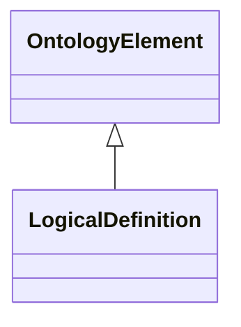

# Class: LogicalDefinition


URI: [om:LogicalDefinition](om:LogicalDefinition)





## Inheritance
* [OntologyElement](OntologyElement.md)
    * **LogicalDefinition**


## Slots

| Name | Range | Cardinality | Description  | Info |
| ---  | --- | --- | --- | --- |


## Usages


## Identifier and Mapping Information


### Schema Source


* from schema: https://w3id.org/kgcl/ontology


## Mappings

| Mapping Type | Mapped Value |
| ---  | ---  |
| self | ['om:LogicalDefinition'] |
| native | ['om:LogicalDefinition'] |


## LinkML Specification

<!-- TODO: investigate https://stackoverflow.com/questions/37606292/how-to-create-tabbed-code-blocks-in-mkdocs-or-sphinx -->

### Direct

<details>
```yaml
name: logical definition
from_schema: https://w3id.org/kgcl/ontology
is_a: ontology element

```
</details>

### Induced

<details>
```yaml
name: logical definition
from_schema: https://w3id.org/kgcl/ontology
is_a: ontology element

```
</details>