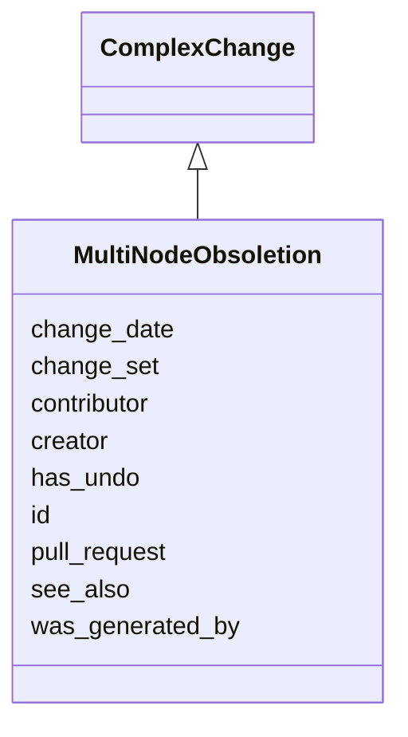

# Class: MultiNodeObsoletion
_A complex change consisting of multiple obsoletions._


URI: [kgcl:MultiNodeObsoletion](http://w3id.org/kgcl/MultiNodeObsoletion)





## Inheritance
* [Change](Change.md)
    * [ComplexChange](ComplexChange.md)
        * **MultiNodeObsoletion**


## Slots

| Name | Range | Cardinality | Description  | Info |
| ---  | --- | --- | --- | --- |
| [change_set](change_set.md) | [NodeObsoletion](NodeObsoletion.md) | 0..* | A collection of changes  | . |
| [id](id.md) | [xsd:string](xsd:string) | 0..1 | None  | . |
| [was_generated_by](was_generated_by.md) | [Activity](Activity.md) | 0..1 | None  | . |
| [see_also](see_also.md) | [xsd:string](xsd:string) | 0..1 | None  | . |
| [pull_request](pull_request.md) | [xsd:string](xsd:string) | 0..1 | None  | . |
| [creator](creator.md) | [xsd:string](xsd:string) | 0..1 | None  | . |
| [change_date](change_date.md) | [xsd:string](xsd:string) | 0..1 | None  | . |
| [contributor](contributor.md) | [xsd:string](xsd:string) | 0..1 | None  | . |
| [has_undo](has_undo.md) | [Change](Change.md) | 0..1 | A change that reverses this change  | . |


## Usages


## Identifier and Mapping Information


### Schema Source


* from schema: https://w3id.org/kgcl


## Mappings

| Mapping Type | Mapped Value |
| ---  | ---  |
| self | ['kgcl:MultiNodeObsoletion'] |
| native | ['kgcl:MultiNodeObsoletion'] |


## LinkML Specification

<!-- TODO: investigate https://stackoverflow.com/questions/37606292/how-to-create-tabbed-code-blocks-in-mkdocs-or-sphinx -->

### Direct

<details>
```yaml
name: multi node obsoletion
description: A complex change consisting of multiple obsoletions.
from_schema: https://w3id.org/kgcl
see_also:
- https://github.com/cmungall/obo-scripts/blob/master/obo-obsoletify.pl
aliases:
- multi node deprecation
- multi class obsoletion
- multi term obsoletion
- multi concept obsoletion
is_a: complex change
slot_usage:
  change set:
    name: change set
    range: node obsoletion
  change description:
    name: change description
    string_serialization: a multi node obsoletion consisting of {change set}
  associated change set:
    name: associated change set
    description: "All changes associated with a set of obsoletions. This change set\
      \ is the composed change set rather than the set of individual changes. For\
      \ example, if previous state is:\n  `A subClassOf B subClassOf C subClassOf\
      \ D`\nand we obsolete {B,C}, then the individual changes are `A moves from B\
      \ to C` and `B moves from C to D`, but the composed change set is `A moves from\
      \ B to D`"
    is_a: change set

```
</details>

### Induced

<details>
```yaml
name: multi node obsoletion
description: A complex change consisting of multiple obsoletions.
from_schema: https://w3id.org/kgcl
see_also:
- https://github.com/cmungall/obo-scripts/blob/master/obo-obsoletify.pl
aliases:
- multi node deprecation
- multi class obsoletion
- multi term obsoletion
- multi concept obsoletion
is_a: complex change
slot_usage:
  change set:
    name: change set
    range: node obsoletion
  change description:
    name: change description
    string_serialization: a multi node obsoletion consisting of {change set}
  associated change set:
    name: associated change set
    description: "All changes associated with a set of obsoletions. This change set\
      \ is the composed change set rather than the set of individual changes. For\
      \ example, if previous state is:\n  `A subClassOf B subClassOf C subClassOf\
      \ D`\nand we obsolete {B,C}, then the individual changes are `A moves from B\
      \ to C` and `B moves from C to D`, but the composed change set is `A moves from\
      \ B to D`"
    is_a: change set
attributes:
  change set:
    name: change set
    description: A collection of changes
    from_schema: https://w3id.org/kgcl
    multivalued: true
    alias: change_set
    owner: multi node obsoletion
    range: node obsoletion
    inlined: true
    inlined_as_list: true
  id:
    name: id
    from_schema: https://w3id.org/kgcl/basics
    identifier: true
    alias: id
    owner: multi node obsoletion
    range: string
  was generated by:
    name: was generated by
    from_schema: https://w3id.org/kgcl/prov
    slot_uri: prov:wasGeneratedBy
    alias: was_generated_by
    owner: multi node obsoletion
    range: activity
  see also:
    name: see also
    from_schema: https://w3id.org/kgcl
    slot_uri: rdfs:seeAlso
    alias: see_also
    owner: multi node obsoletion
    range: string
  pull request:
    name: pull request
    from_schema: https://w3id.org/kgcl
    alias: pull_request
    owner: multi node obsoletion
    range: string
  creator:
    name: creator
    from_schema: https://w3id.org/kgcl
    slot_uri: dcterms:creator
    alias: creator
    owner: multi node obsoletion
    range: string
  change date:
    name: change date
    from_schema: https://w3id.org/kgcl
    slot_uri: dcterms:date
    alias: change_date
    owner: multi node obsoletion
    range: string
  contributor:
    name: contributor
    from_schema: https://w3id.org/kgcl
    slot_uri: dcterms:creator
    alias: contributor
    owner: multi node obsoletion
    range: string
  has undo:
    name: has undo
    description: A change that reverses this change
    from_schema: https://w3id.org/kgcl
    domain: change
    multivalued: false
    alias: has_undo
    owner: multi node obsoletion
    range: change

```
</details>