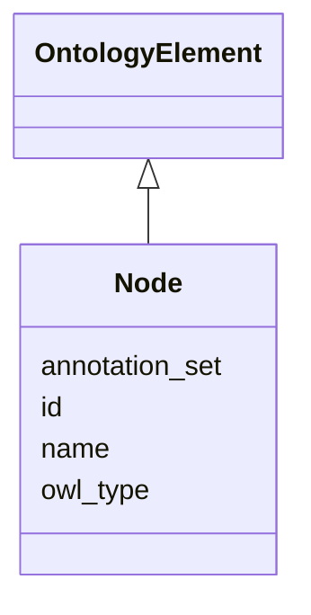

# Class: Node
_Any named entity in an ontology. May be a class, individual, property_


URI: [om:Node](om:Node)





## Inheritance
* [OntologyElement](OntologyElement.md)
    * **Node**
        * [ClassNode](ClassNode.md)
        * [InstanceNode](InstanceNode.md)


## Slots

| Name | Range | Cardinality | Description  | Info |
| ---  | --- | --- | --- | --- |
| [id](id.md) | [xsd:string](xsd:string) | 0..1 | None  | . |
| [name](name.md) | [xsd:string](xsd:string) | 0..1 | None  | . |
| [annotation_set](annotation_set.md) | [Annotation](Annotation.md) | 0..1 | None  | . |
| [owl_type](owl_type.md) | [OwlTypeEnum](OwlTypeEnum.md) | 0..1 | None  | . |


## Usages


| used by | used in | type | used |
| ---  | --- | --- | --- |
| [EdgeCreation](EdgeCreation.md) | [subject](subject.md) | range | node |
| [EdgeCreation](EdgeCreation.md) | [predicate](predicate.md) | range | node |
| [EdgeCreation](EdgeCreation.md) | [object](object.md) | range | node |
| [PlaceUnder](PlaceUnder.md) | [subject](subject.md) | range | node |
| [PlaceUnder](PlaceUnder.md) | [predicate](predicate.md) | range | node |
| [PlaceUnder](PlaceUnder.md) | [object](object.md) | range | node |
| [EdgeDeletion](EdgeDeletion.md) | [subject](subject.md) | range | node |
| [EdgeDeletion](EdgeDeletion.md) | [predicate](predicate.md) | range | node |
| [EdgeDeletion](EdgeDeletion.md) | [object](object.md) | range | node |
| [RemoveUnder](RemoveUnder.md) | [subject](subject.md) | range | node |
| [RemoveUnder](RemoveUnder.md) | [predicate](predicate.md) | range | node |
| [RemoveUnder](RemoveUnder.md) | [object](object.md) | range | node |
| [EdgeObsoletion](EdgeObsoletion.md) | [subject](subject.md) | range | node |
| [EdgeObsoletion](EdgeObsoletion.md) | [predicate](predicate.md) | range | node |
| [EdgeObsoletion](EdgeObsoletion.md) | [object](object.md) | range | node |
| [MappingCreation](MappingCreation.md) | [subject](subject.md) | range | node |
| [MappingCreation](MappingCreation.md) | [predicate](predicate.md) | range | node |
| [MappingCreation](MappingCreation.md) | [object](object.md) | range | node |
| [NodeChange](NodeChange.md) | [about_node](about_node.md) | range | node |
| [NodeRename](NodeRename.md) | [about_node](about_node.md) | range | node |
| [SetLanguageForName](SetLanguageForName.md) | [about_node](about_node.md) | range | node |
| [NodeAnnotationChange](NodeAnnotationChange.md) | [about_node](about_node.md) | range | node |
| [NodeAnnotationReplacement](NodeAnnotationReplacement.md) | [about_node](about_node.md) | range | node |
| [NodeSynonymChange](NodeSynonymChange.md) | [about_node](about_node.md) | range | node |
| [NewSynonym](NewSynonym.md) | [about_node](about_node.md) | range | node |
| [NameBecomesSynonym](NameBecomesSynonym.md) | [about_node](about_node.md) | range | node |
| [RemoveSynonym](RemoveSynonym.md) | [about_node](about_node.md) | range | node |
| [SynonymReplacement](SynonymReplacement.md) | [about_node](about_node.md) | range | node |
| [SynonymPredicateChange](SynonymPredicateChange.md) | [about_node](about_node.md) | range | node |
| [NodeTextDefinitionChange](NodeTextDefinitionChange.md) | [about_node](about_node.md) | range | node |
| [NewTextDefinition](NewTextDefinition.md) | [about_node](about_node.md) | range | node |
| [RemoveTextDefinition](RemoveTextDefinition.md) | [about_node](about_node.md) | range | node |
| [TextDefinitionReplacement](TextDefinitionReplacement.md) | [about_node](about_node.md) | range | node |
| [AddNodeToSubset](AddNodeToSubset.md) | [about_node](about_node.md) | range | node |
| [RemovedNodeFromSubset](RemovedNodeFromSubset.md) | [about_node](about_node.md) | range | node |
| [NodeObsoletion](NodeObsoletion.md) | [has_direct_replacement](has_direct_replacement.md) | range | node |
| [NodeObsoletion](NodeObsoletion.md) | [has_nondirect_replacement](has_nondirect_replacement.md) | range | node |
| [NodeObsoletion](NodeObsoletion.md) | [about_node](about_node.md) | range | node |
| [NodeUnobsoletion](NodeUnobsoletion.md) | [about_node](about_node.md) | range | node |
| [NodeCreation](NodeCreation.md) | [node_id](node_id.md) | range | node |
| [NodeCreation](NodeCreation.md) | [about_node](about_node.md) | range | node |
| [ClassCreation](ClassCreation.md) | [superclass](superclass.md) | range | node |
| [ClassCreation](ClassCreation.md) | [node_id](node_id.md) | range | node |
| [ClassCreation](ClassCreation.md) | [about_node](about_node.md) | range | node |
| [NodeDeletion](NodeDeletion.md) | [about_node](about_node.md) | range | node |
| [NodeDirectMerge](NodeDirectMerge.md) | [has_direct_replacement](has_direct_replacement.md) | range | node |
| [NodeDirectMerge](NodeDirectMerge.md) | [has_nondirect_replacement](has_nondirect_replacement.md) | range | node |
| [NodeDirectMerge](NodeDirectMerge.md) | [about_node](about_node.md) | range | node |
| [NodeObsoletionWithDirectReplacement](NodeObsoletionWithDirectReplacement.md) | [has_direct_replacement](has_direct_replacement.md) | range | node |
| [NodeObsoletionWithDirectReplacement](NodeObsoletionWithDirectReplacement.md) | [has_nondirect_replacement](has_nondirect_replacement.md) | range | node |
| [NodeObsoletionWithDirectReplacement](NodeObsoletionWithDirectReplacement.md) | [about_node](about_node.md) | range | node |
| [NodeObsoletionWithNoDirectReplacement](NodeObsoletionWithNoDirectReplacement.md) | [has_direct_replacement](has_direct_replacement.md) | range | node |
| [NodeObsoletionWithNoDirectReplacement](NodeObsoletionWithNoDirectReplacement.md) | [has_nondirect_replacement](has_nondirect_replacement.md) | range | node |
| [NodeObsoletionWithNoDirectReplacement](NodeObsoletionWithNoDirectReplacement.md) | [about_node](about_node.md) | range | node |
| [PropertyValue](PropertyValue.md) | [property](property.md) | range | node |
| [Annotation](Annotation.md) | [property](property.md) | range | node |
| [Edge](Edge.md) | [subject](subject.md) | range | node |
| [Edge](Edge.md) | [predicate](predicate.md) | range | node |
| [Edge](Edge.md) | [object](object.md) | range | node |


## Identifier and Mapping Information


### Schema Source


* from schema: https://w3id.org/kgcl/ontology


## Mappings

| Mapping Type | Mapped Value |
| ---  | ---  |
| self | ['om:Node'] |
| native | ['om:Node'] |


## LinkML Specification

<!-- TODO: investigate https://stackoverflow.com/questions/37606292/how-to-create-tabbed-code-blocks-in-mkdocs-or-sphinx -->

### Direct

<details>
```yaml
name: node
description: Any named entity in an ontology. May be a class, individual, property
from_schema: https://w3id.org/kgcl/ontology
aliases:
- entity
- term
is_a: ontology element
slots:
- id
- name
- annotation set
- owl type

```
</details>

### Induced

<details>
```yaml
name: node
description: Any named entity in an ontology. May be a class, individual, property
from_schema: https://w3id.org/kgcl/ontology
aliases:
- entity
- term
is_a: ontology element
attributes:
  id:
    name: id
    from_schema: https://w3id.org/kgcl/basics
    identifier: true
    alias: id
    owner: node
    range: string
  name:
    name: name
    from_schema: https://w3id.org/kgcl/ontology
    alias: name
    owner: node
    range: string
  annotation set:
    name: annotation set
    from_schema: https://w3id.org/kgcl/ontology
    alias: annotation_set
    owner: node
    range: annotation
  owl type:
    name: owl type
    from_schema: https://w3id.org/kgcl/ontology
    alias: owl_type
    owner: node
    range: owl_type_enum

```
</details>