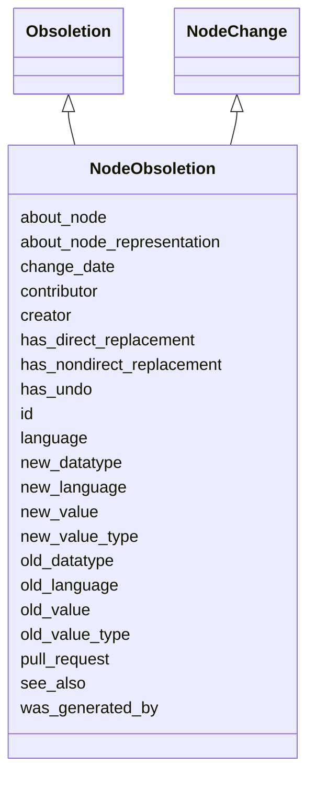

# Class: NodeObsoletion
_Obsoletion of a node deprecates usage of that node, but does not delete it._


URI: [kgcl:NodeObsoletion](http://w3id.org/kgcl/NodeObsoletion)





## Inheritance
* [Change](Change.md)
    * [SimpleChange](SimpleChange.md)
        * [NodeChange](NodeChange.md)
            * **NodeObsoletion** [ obsoletion]
                * [NodeDirectMerge](NodeDirectMerge.md) [ allows automatic replacement of edges]
                * [NodeObsoletionWithDirectReplacement](NodeObsoletionWithDirectReplacement.md) [ allows automatic replacement of edges]
                * [NodeObsoletionWithNoDirectReplacement](NodeObsoletionWithNoDirectReplacement.md)


## Slots

| Name | Range | Cardinality | Description  | Info |
| ---  | --- | --- | --- | --- |
| [has_direct_replacement](has_direct_replacement.md) | [Node](Node.md) | 0..1 | An obsoletion replacement where it IS valid to automatically update annotations/edges pointing at the node with its direct replacement  | . |
| [has_nondirect_replacement](has_nondirect_replacement.md) | [Node](Node.md) | 0..* | An obsoletion replacement where it is NOT valid to automatically update annotations/edges pointing at the node with its direct replacement  | . |
| [about_node](about_node.md) | [Node](Node.md) | 0..1 | None  | . |
| [about_node_representation](about_node_representation.md) | [xsd:string](xsd:string) | 0..1 | The representation of a node (URI, CURIE, label)   | . |
| [language](language.md) | [language_tag](language_tag.md) | 0..1 | The language tag of a literal  | . |
| [old_value](old_value.md) | [xsd:string](xsd:string) | 0..1 | The value of a property held in the old instance of the ontology  | . |
| [new_value](new_value.md) | [xsd:string](xsd:string) | 0..1 | The value of a property held in the new instance of the ontology  | . |
| [old_value_type](old_value_type.md) | [xsd:string](xsd:string) | 0..1 | The type (IRI or Literal) of an old value  | . |
| [new_value_type](new_value_type.md) | [xsd:string](xsd:string) | 0..1 | The type (IRI or Literal) of a new value  | . |
| [new_language](new_language.md) | [xsd:string](xsd:string) | 0..1 | The new language tag of a literal  | . |
| [old_language](old_language.md) | [xsd:string](xsd:string) | 0..1 | The old language tag of a literal  | . |
| [new_datatype](new_datatype.md) | [xsd:string](xsd:string) | 0..1 | The new datatype of a literal  | . |
| [old_datatype](old_datatype.md) | [xsd:string](xsd:string) | 0..1 | The old datatype of a literal  | . |
| [id](id.md) | [xsd:string](xsd:string) | 0..1 | None  | . |
| [was_generated_by](was_generated_by.md) | [Activity](Activity.md) | 0..1 | None  | . |
| [see_also](see_also.md) | [xsd:string](xsd:string) | 0..1 | None  | . |
| [pull_request](pull_request.md) | [xsd:string](xsd:string) | 0..1 | None  | . |
| [creator](creator.md) | [xsd:string](xsd:string) | 0..1 | None  | . |
| [change_date](change_date.md) | [xsd:string](xsd:string) | 0..1 | None  | . |
| [contributor](contributor.md) | [xsd:string](xsd:string) | 0..1 | None  | . |
| [has_undo](has_undo.md) | [Obsoletion](Obsoletion.md) | 0..1 | A change that reverses this change  | . |


## Usages


| used by | used in | type | used |
| ---  | --- | --- | --- |
| [MultiNodeObsoletion](MultiNodeObsoletion.md) | [change_set](change_set.md) | range | node obsoletion |


## Identifier and Mapping Information


### Schema Source


* from schema: https://w3id.org/kgcl


## Mappings

| Mapping Type | Mapped Value |
| ---  | ---  |
| self | ['kgcl:NodeObsoletion'] |
| native | ['kgcl:NodeObsoletion'] |


## LinkML Specification

<!-- TODO: investigate https://stackoverflow.com/questions/37606292/how-to-create-tabbed-code-blocks-in-mkdocs-or-sphinx -->

### Direct

<details>
```yaml
name: node obsoletion
description: Obsoletion of a node deprecates usage of that node, but does not delete
  it.
from_schema: https://w3id.org/kgcl
see_also:
- http://wiki.geneontology.org/index.php/Obsoleting_an_Existing_Ontology_Term
aliases:
- node deprecation
- class obsoletion
- term obsoletion
- concept obsoletion
is_a: node change
mixins:
- obsoletion
slots:
- has direct replacement
- has nondirect replacement
slot_usage:
  change description:
    name: change description
    string_serialization: obsoleting {about}
  associated change set:
    name: associated change set
    description: 'All changes forced as a result of this obsoletion. For example,
      starting with `A subClassOf B subClassOf C`, if we obsolete node B, then we
      may decide to bundle in a node move change of A from B to C. Note: this change
      set is not considered a part of the obsoletion, as obsoletion is considered
      atomic/simple. Instead this is a reference to a change set that may exist elsewhere'
    is_a: change set

```
</details>

### Induced

<details>
```yaml
name: node obsoletion
description: Obsoletion of a node deprecates usage of that node, but does not delete
  it.
from_schema: https://w3id.org/kgcl
see_also:
- http://wiki.geneontology.org/index.php/Obsoleting_an_Existing_Ontology_Term
aliases:
- node deprecation
- class obsoletion
- term obsoletion
- concept obsoletion
is_a: node change
mixins:
- obsoletion
slot_usage:
  change description:
    name: change description
    string_serialization: obsoleting {about}
  associated change set:
    name: associated change set
    description: 'All changes forced as a result of this obsoletion. For example,
      starting with `A subClassOf B subClassOf C`, if we obsolete node B, then we
      may decide to bundle in a node move change of A from B to C. Note: this change
      set is not considered a part of the obsoletion, as obsoletion is considered
      atomic/simple. Instead this is a reference to a change set that may exist elsewhere'
    is_a: change set
attributes:
  has direct replacement:
    name: has direct replacement
    description: An obsoletion replacement where it IS valid to automatically update
      annotations/edges pointing at the node with its direct replacement
    comments:
    - if a node obsoletion C, C about N1, and C has direct replacement N2, and there
      exists an edge with an edge property referencing N1, it is possible to replace
      with N2
    - if a node obsoletion C C about N1, and Chas direct replacement N2, then N1 IAO:0100001
      N2
    from_schema: https://w3id.org/kgcl
    close_mappings:
    - IAO:0100001
    multivalued: false
    alias: has_direct_replacement
    owner: node obsoletion
    range: node
  has nondirect replacement:
    name: has nondirect replacement
    description: An obsoletion replacement where it is NOT valid to automatically
      update annotations/edges pointing at the node with its direct replacement
    comments:
    - if a node obsoletion C, C about N1, and C has direct replacement N2, and there
      exists an edge with an edge property referencing N1, it is possible to replace
      with N2
    - if a node obsoletion C C about N1, and Chas direct replacement N2, then N1 oio:consider
      N2
    from_schema: https://w3id.org/kgcl
    close_mappings:
    - oio:consider
    multivalued: true
    alias: has_nondirect_replacement
    owner: node obsoletion
    range: node
  about node:
    name: about node
    from_schema: https://w3id.org/kgcl
    is_a: about
    multivalued: false
    alias: about_node
    owner: node obsoletion
    range: node
  about node representation:
    name: about node representation
    description: 'The representation of a node (URI, CURIE, label) '
    from_schema: https://w3id.org/kgcl
    alias: about_node_representation
    owner: node obsoletion
    range: string
  language:
    name: language
    description: The language tag of a literal
    from_schema: https://w3id.org/kgcl
    alias: language
    owner: node obsoletion
    range: language tag
  old value:
    name: old value
    description: The value of a property held in the old instance of the ontology
    from_schema: https://w3id.org/kgcl
    alias: old_value
    owner: node obsoletion
    range: string
  new value:
    name: new value
    description: The value of a property held in the new instance of the ontology
    from_schema: https://w3id.org/kgcl
    alias: new_value
    owner: node obsoletion
    range: string
  old value type:
    name: old value type
    description: The type (IRI or Literal) of an old value
    from_schema: https://w3id.org/kgcl
    alias: old_value_type
    owner: node obsoletion
    range: string
  new value type:
    name: new value type
    description: The type (IRI or Literal) of a new value
    from_schema: https://w3id.org/kgcl
    alias: new_value_type
    owner: node obsoletion
    range: string
  new language:
    name: new language
    description: The new language tag of a literal
    from_schema: https://w3id.org/kgcl
    alias: new_language
    owner: node obsoletion
    range: string
  old language:
    name: old language
    description: The old language tag of a literal
    from_schema: https://w3id.org/kgcl
    alias: old_language
    owner: node obsoletion
    range: string
  new datatype:
    name: new datatype
    description: The new datatype of a literal
    from_schema: https://w3id.org/kgcl
    alias: new_datatype
    owner: node obsoletion
    range: string
  old datatype:
    name: old datatype
    description: The old datatype of a literal
    from_schema: https://w3id.org/kgcl
    alias: old_datatype
    owner: node obsoletion
    range: string
  id:
    name: id
    from_schema: https://w3id.org/kgcl/basics
    identifier: true
    alias: id
    owner: node obsoletion
    range: string
  was generated by:
    name: was generated by
    from_schema: https://w3id.org/kgcl/prov
    slot_uri: prov:wasGeneratedBy
    alias: was_generated_by
    owner: node obsoletion
    range: activity
  see also:
    name: see also
    from_schema: https://w3id.org/kgcl
    slot_uri: rdfs:seeAlso
    alias: see_also
    owner: node obsoletion
    range: string
  pull request:
    name: pull request
    from_schema: https://w3id.org/kgcl
    alias: pull_request
    owner: node obsoletion
    range: string
  creator:
    name: creator
    from_schema: https://w3id.org/kgcl
    slot_uri: dcterms:creator
    alias: creator
    owner: node obsoletion
    range: string
  change date:
    name: change date
    from_schema: https://w3id.org/kgcl
    slot_uri: dcterms:date
    alias: change_date
    owner: node obsoletion
    range: string
  contributor:
    name: contributor
    from_schema: https://w3id.org/kgcl
    slot_uri: dcterms:creator
    alias: contributor
    owner: node obsoletion
    range: string
  has undo:
    name: has undo
    description: A change that reverses this change
    from_schema: https://w3id.org/kgcl
    domain: change
    multivalued: false
    alias: has_undo
    owner: node obsoletion
    range: obsoletion

```
</details>