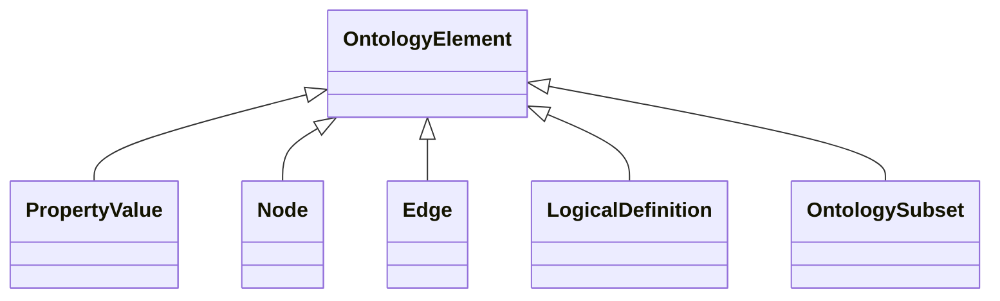

# Class: OntologyElement
_Any component of an ontology or knowledge graph_


URI: [om:OntologyElement](om:OntologyElement)





## Inheritance
* **OntologyElement**
    * [PropertyValue](PropertyValue.md)
    * [Node](Node.md)
    * [Edge](Edge.md)
    * [LogicalDefinition](LogicalDefinition.md)
    * [OntologySubset](OntologySubset.md)


## Slots

| Name | Range | Cardinality | Description  | Info |
| ---  | --- | --- | --- | --- |


## Usages


## Identifier and Mapping Information


### Schema Source


* from schema: https://w3id.org/kgcl/ontology


## Mappings

| Mapping Type | Mapped Value |
| ---  | ---  |
| self | ['om:OntologyElement'] |
| native | ['om:OntologyElement'] |


## LinkML Specification

<!-- TODO: investigate https://stackoverflow.com/questions/37606292/how-to-create-tabbed-code-blocks-in-mkdocs-or-sphinx -->

### Direct

<details>
```yaml
name: ontology element
description: Any component of an ontology or knowledge graph
from_schema: https://w3id.org/kgcl/ontology
aliases:
- entity

```
</details>

### Induced

<details>
```yaml
name: ontology element
description: Any component of an ontology or knowledge graph
from_schema: https://w3id.org/kgcl/ontology
aliases:
- entity

```
</details>