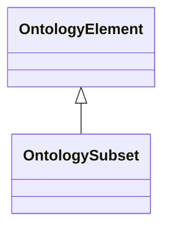

# Class: OntologySubset


URI: [om:OntologySubset](om:OntologySubset)





## Inheritance
* [OntologyElement](OntologyElement.md)
    * **OntologySubset**


## Slots

| Name | Range | Cardinality | Description  | Info |
| ---  | --- | --- | --- | --- |


## Usages


| used by | used in | type | used |
| ---  | --- | --- | --- |
| [SubsetMembershipChange](SubsetMembershipChange.md) | [in_subset](in_subset.md) | range | ontology subset |
| [AddToSubset](AddToSubset.md) | [in_subset](in_subset.md) | range | ontology subset |
| [RemoveFromSubset](RemoveFromSubset.md) | [in_subset](in_subset.md) | range | ontology subset |
| [AddNodeToSubset](AddNodeToSubset.md) | [in_subset](in_subset.md) | range | ontology subset |
| [RemovedNodeFromSubset](RemovedNodeFromSubset.md) | [in_subset](in_subset.md) | range | ontology subset |


## Identifier and Mapping Information


### Schema Source


* from schema: https://w3id.org/kgcl/ontology


## Mappings

| Mapping Type | Mapped Value |
| ---  | ---  |
| self | ['om:OntologySubset'] |
| native | ['om:OntologySubset'] |


## LinkML Specification

<!-- TODO: investigate https://stackoverflow.com/questions/37606292/how-to-create-tabbed-code-blocks-in-mkdocs-or-sphinx -->

### Direct

<details>
```yaml
name: ontology subset
from_schema: https://w3id.org/kgcl/ontology
is_a: ontology element

```
</details>

### Induced

<details>
```yaml
name: ontology subset
from_schema: https://w3id.org/kgcl/ontology
is_a: ontology element

```
</details>