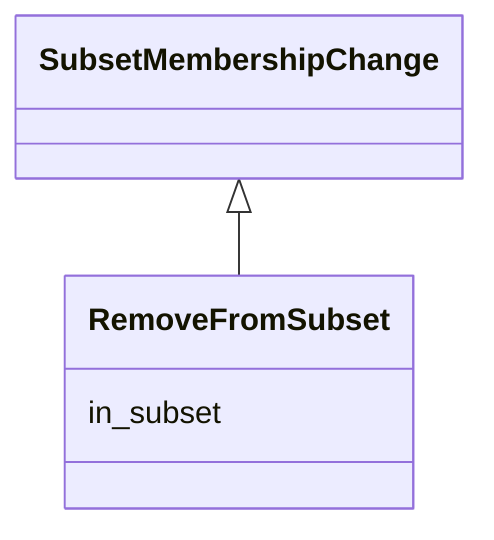

# Class: RemoveFromSubset
_removing an element from a subset_


* __NOTE__: this is a mixin class intended to be used in combination with other classes, and not used directly


URI: [kgcl:RemoveFromSubset](http://w3id.org/kgcl/RemoveFromSubset)





## Inheritance
* [ChangeMixin](ChangeMixin.md)
    * [SubsetMembershipChange](SubsetMembershipChange.md)
        * **RemoveFromSubset**


## Slots

| Name | Range | Cardinality | Description  | Info |
| ---  | --- | --- | --- | --- |
| [in_subset](in_subset.md) | [OntologySubset](OntologySubset.md) | 0..1 | subset that the element is being removed from  | . |


## Usages


## Identifier and Mapping Information


### Schema Source


* from schema: https://w3id.org/kgcl


## Mappings

| Mapping Type | Mapped Value |
| ---  | ---  |
| self | ['kgcl:RemoveFromSubset'] |
| native | ['kgcl:RemoveFromSubset'] |


## LinkML Specification

<!-- TODO: investigate https://stackoverflow.com/questions/37606292/how-to-create-tabbed-code-blocks-in-mkdocs-or-sphinx -->

### Direct

<details>
```yaml
name: remove from subset
description: removing an element from a subset
from_schema: https://w3id.org/kgcl
is_a: subset membership change
mixin: true
slot_usage:
  in subset:
    name: in subset
    description: subset that the element is being removed from
  has undo:
    name: has undo
    range: add to subset

```
</details>

### Induced

<details>
```yaml
name: remove from subset
description: removing an element from a subset
from_schema: https://w3id.org/kgcl
is_a: subset membership change
mixin: true
slot_usage:
  in subset:
    name: in subset
    description: subset that the element is being removed from
  has undo:
    name: has undo
    range: add to subset
attributes:
  in subset:
    name: in subset
    description: subset that the element is being removed from
    from_schema: https://w3id.org/kgcl
    alias: in_subset
    owner: remove from subset
    range: ontology subset

```
</details>