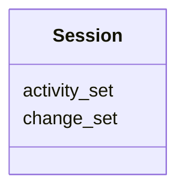

# Class: Session
_A session consists of a set of change sets bundled with the activities that generated those change sets_


URI: [kgcl:Session](http://w3id.org/kgcl/Session)





<!-- no inheritance hierarchy -->


## Slots

| Name | Range | Cardinality | Description  | Info |
| ---  | --- | --- | --- | --- |
| [change_set](change_set.md) | [Change](Change.md) | 0..* | A collection of changes  | . |
| [activity_set](activity_set.md) | [Activity](Activity.md) | 0..* | None  | . |


## Usages


## Identifier and Mapping Information


### Schema Source


* from schema: https://w3id.org/kgcl


## Mappings

| Mapping Type | Mapped Value |
| ---  | ---  |
| self | ['kgcl:Session'] |
| native | ['kgcl:Session'] |


## LinkML Specification

<!-- TODO: investigate https://stackoverflow.com/questions/37606292/how-to-create-tabbed-code-blocks-in-mkdocs-or-sphinx -->

### Direct

<details>
```yaml
name: session
description: A session consists of a set of change sets bundled with the activities
  that generated those change sets
from_schema: https://w3id.org/kgcl
slots:
- change set
- activity set

```
</details>

### Induced

<details>
```yaml
name: session
description: A session consists of a set of change sets bundled with the activities
  that generated those change sets
from_schema: https://w3id.org/kgcl
attributes:
  change set:
    name: change set
    description: A collection of changes
    from_schema: https://w3id.org/kgcl
    multivalued: true
    alias: change_set
    owner: session
    range: change
    inlined: true
    inlined_as_list: true
  activity set:
    name: activity set
    from_schema: https://w3id.org/kgcl/prov
    multivalued: true
    alias: activity_set
    owner: session
    range: activity
    inlined: true
    inlined_as_list: true

```
</details>