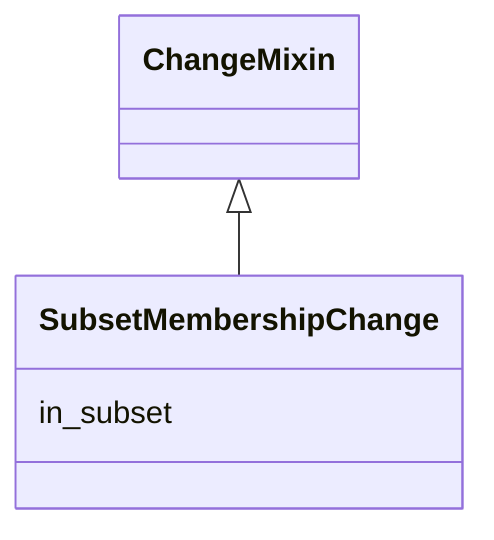

# Class: SubsetMembershipChange
_A change in the membership status of a node with respect to a subset (view)_


* __NOTE__: this is a mixin class intended to be used in combination with other classes, and not used directly


URI: [kgcl:SubsetMembershipChange](http://w3id.org/kgcl/SubsetMembershipChange)





## Inheritance
* [ChangeMixin](ChangeMixin.md)
    * **SubsetMembershipChange**
        * [AddToSubset](AddToSubset.md)
        * [RemoveFromSubset](RemoveFromSubset.md)


## Slots

| Name | Range | Cardinality | Description  | Info |
| ---  | --- | --- | --- | --- |
| [in_subset](in_subset.md) | [OntologySubset](OntologySubset.md) | 0..1 | The subset that pertains to this change  | . |


## Usages


## Identifier and Mapping Information


### Schema Source


* from schema: https://w3id.org/kgcl


## Mappings

| Mapping Type | Mapped Value |
| ---  | ---  |
| self | ['kgcl:SubsetMembershipChange'] |
| native | ['kgcl:SubsetMembershipChange'] |


## LinkML Specification

<!-- TODO: investigate https://stackoverflow.com/questions/37606292/how-to-create-tabbed-code-blocks-in-mkdocs-or-sphinx -->

### Direct

<details>
```yaml
name: subset membership change
description: A change in the membership status of a node with respect to a subset
  (view)
from_schema: https://w3id.org/kgcl
is_a: change mixin
mixin: true
slots:
- in subset

```
</details>

### Induced

<details>
```yaml
name: subset membership change
description: A change in the membership status of a node with respect to a subset
  (view)
from_schema: https://w3id.org/kgcl
is_a: change mixin
mixin: true
attributes:
  in subset:
    name: in subset
    description: The subset that pertains to this change
    from_schema: https://w3id.org/kgcl
    alias: in_subset
    owner: subset membership change
    range: ontology subset

```
</details>