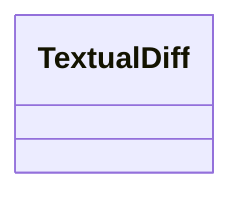

# Class: TextualDiff
_A summarizing of a change on a piece of text. This could be rendered in a number of different ways_


URI: [kgcl:TextualDiff](http://w3id.org/kgcl/TextualDiff)





<!-- no inheritance hierarchy -->


## Slots

| Name | Range | Cardinality | Description  | Info |
| ---  | --- | --- | --- | --- |


## Usages


| used by | used in | type | used |
| ---  | --- | --- | --- |
| [NodeRename](NodeRename.md) | [has_textual_diff](has_textual_diff.md) | range | textual diff |
| [SynonymReplacement](SynonymReplacement.md) | [has_textual_diff](has_textual_diff.md) | range | textual diff |
| [SynonymPredicateChange](SynonymPredicateChange.md) | [has_textual_diff](has_textual_diff.md) | range | textual diff |
| [TextDefinitionReplacement](TextDefinitionReplacement.md) | [has_textual_diff](has_textual_diff.md) | range | textual diff |


## Identifier and Mapping Information


### Schema Source


* from schema: https://w3id.org/kgcl


## Mappings

| Mapping Type | Mapped Value |
| ---  | ---  |
| self | ['kgcl:TextualDiff'] |
| native | ['kgcl:TextualDiff'] |


## LinkML Specification

<!-- TODO: investigate https://stackoverflow.com/questions/37606292/how-to-create-tabbed-code-blocks-in-mkdocs-or-sphinx -->

### Direct

<details>
```yaml
name: textual diff
description: A summarizing of a change on a piece of text. This could be rendered
  in a number of different ways
from_schema: https://w3id.org/kgcl

```
</details>

### Induced

<details>
```yaml
name: textual diff
description: A summarizing of a change on a piece of text. This could be rendered
  in a number of different ways
from_schema: https://w3id.org/kgcl

```
</details>