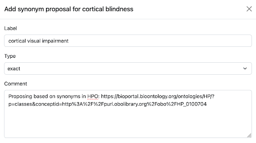

# BioPortal Implementation

In BioPortal we leverage the KGCL standard to provide an easy workflow for users to request ontology changes. When users browse ontology classes, they now have access to a set of web forms in the user interface that allows them to enter information about their proposed change. The following figure shows a web form to request the addition of a synonym to the ‘cortical blindness’ class in the Mondo Disease Ontology (Mondo):



Providing web forms enables users to file a change request proposal without needing to know the particulars of the KGCL command syntax. Each web form presented to users has the necessary fields to collect data that is specific to the various change types, e.g., for the addition of a synonym the user will have a dropdown field that allows them to specify the type of synonym such as exact, narrow, broad, or related.

When users submit change request proposals via web forms, BioPortal collects the data and generates content for issues that are sent to GitHub in the repository where the ontology source file is maintained. The issues have human readable titles, and the body contents hold a machine-processable string that precisely describes the requested change as a KGCL command. Since a good deal of text across these issues is common, we used Ruby’s ERB templating system to build templates for each change request type. A GitHub issue title template for adding a synonym to a class appears as such in the BioPortal codebase:

```ruby
Proposal: add synonym '<%= synonym_label %>' for <%= concept_label %>
```

After form submission the template is evaluated at runtime and the appropriate fields are dynamically replaced to create the human readable version:

```ruby
Proposal: add synonym ‘cortical visual impairment’ for cortical blindness
```

The following figure shows the auto-generated body of the GitHub issue where a user requested the addition of “cortical visual impairment” as a synonym of “cortical blindness” in the Mondo ontology. BioPortal translated this change request to the machine-processable KGCL “create exact synonym” command:


Auto-generating issues from BioPortal with KGCL commands in the body allows complementary software such as Ontobot to detect these commands and programmatically implement the requested changes. This in turn saves ontology maintainers time, as they no longer have to implement the requested changes manually.

In order to generate GitHub issues from BioPortal, we make use of the GraphQL Client Ruby library for composing and executing GraphQL queries. This library allows us to interact with GitHub’s GraphQL API to look up repositories where ontology maintainers indicate their ontologies are housed, and programmatically create issues. Assuming an issue is successfully generated, GitHub’s GraphQL API returns the issue ID, and BioPortal displays a success message to users with a hyperlink that allows them to easily navigate to and view the issue page in GitHub:


BioPortal currently supports four KGCL change request types:
 - Synonym creation
 - Synonym removal
 - Class obsoletion
 - Class renaming
