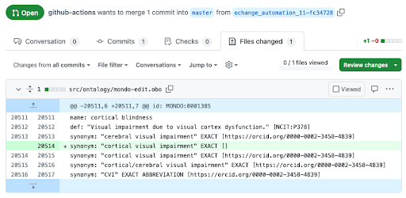

# GitHub Integration

KGCL can be used in combination with GitHub actions, to allow pull requests to be automatically triggered from issues that contain KGCL directives.

For further information see [ontobot-change-agent](https://github.com/INCATools/ontobot-change-agent)

The ontobot-change-agent (Ontobot) is a GitHub-based bot for updating ontologies by leveraging KGCL commands and pull requests. Once successfully installed in a GitHub repository, Ontobot listens for the creation of new issues and edits to existing issues. When it detects either of these events, it reads the body of the issue and looks for a particular text string of “Hey ontobot!, apply:”. Assuming it finds such a string, Ontobot understands that to follow will be a bulleted list of change requests for the ontology, written in the KGCL syntax. The following figure shows an example of a new GitHub issue in which the author uses KGCL to request addition of a synonym to a class in the Mondo Disease Ontology (MONDO):

Ontobot reads the list of one or more KGCL commands, and proceeds to automatically generate a GitHub pull request (PR) that implements the requested changes in a copy of the ontology source file. After the PR is generated, ontology maintainers have an opportunity to review and either merge or deny the changes. The following figure shows the changes encapsulated in an auto-generated PR to add a synonym to a class in MONDO:

If an ontology maintainer is satisfied with the modifications made by Ontobot, they can simply approve the pull request and the changes will be merged into the main ontology source file.
